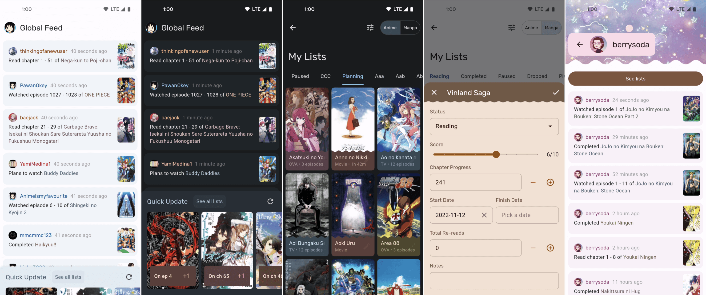

# Aoba

Aoba is a work-in-progress AniList client app.

## Who is this app for? Roadmap?

My primary purposes for working on this project are fun, learning, contentment, and personal use. While I prioritize these, I do try to make sure the app is usable, so if you don't mind running alpha software with no support, please feel free to come along for the ride ([Google Play](https://play.google.com/store/apps/details?id=dev.ihsan.aoba)). I do intend to bring this app to a point where it is sufficiently capable (but likely still limited compared to the website) but give no promises.

## iOS support

While I don't actively test on iOS, the app should run without major issues (after implementing a few missing pieces). However, I'm currently not interested in paying $99/y for an Apple Developer account. Once the app is mostly feature-complete, I will likely bring it to iOS.

## Issues

I'm currently not looking for bug reports (sorry). With my current goals (see above), dealing with issue reports would take away from my ability to work on what I want to focus on and introduce pressure into the project, which is what differentiates this project from work.

## Contributing

For the time being, I'm also not looking for contributions. In these initial stages, I would like to have complete control and avoid spending time reviewing PRs or working to align with other developers. Hopefully at some point this will change.

## Get in touch

All that about issues and contributions said, if you have a question or otherwise something to say/suggest, I would be happy to talk. Email preferred.

## Getting Started & docs

See the [docs](docs).
