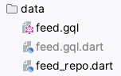
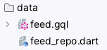
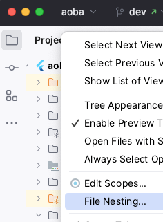

# Getting started

To get the app running, you will need do a few things first.

## Flutter Version Manager, Flutter SDK, tools

Aoba relies on [FVM](https://github.com/fluttertools/fvm) to use the beta channel of Flutter while avoiding messing with any other local Flutter installation, and uses `flutter_gen` to generate constants for its assets.

1. [Install FVM](https://fvm.app/docs/getting_started/installation) if you don't already have it
2. Run `fvm install` in project directory
3. Install [flutter_gen](https://github.com/FlutterGen/flutter_gen): `fvm dart pub global activate flutter_gen`
4. Any time you need to run a `flutter` command, run it with FVM: `fvm flutter doctor`.

If you are on VSCode, that's all.

### IntelliJ IDEA / Android Studio

If you are on IntelliJ IDEA or Android Studio, you will need to manually set the SDK path for the project. To do so, refer to the [FVM docs](https://fvm.app/docs/getting_started/configuration#android-studio). In brief:
1. Go to `Languages & Frameworks > Flutter`
2. Set `Flutter SDK path` to the **absolute** path of `./.fvm/flutter_sdk`, so something like `/Users/username/Projects/aoba/.fvm/flutter_sdk`.

#### File Nesting

It is recommended that you enable File Nesting for generated files to avoid clutter.

| Before | After |
| --- | --- |
|  |  |

  
To do so:

1. Right-click on the title of the Project panel and select `File Nesting`
   
   
2. Add/append the following entries as necessary:

   | Parent File Suffix   | Child File Suffix   |
   |----------------------|---------------------|
   | `.dart`              | `.g.dart; .gr.dart` |
   | `.gql`               | `.gql.dart`         |

## Change the redirect URL Scheme

1. Open the [AndroidManifest](../android/app/src/main/AndroidManifest.xml) file and find the section configuring deep links. Replace the value of `android:scheme` from `aoba-anilist` to whatever else you like.
2. _TODO: Add iOS instructions whenever we implement auth on iOS_

## Register an app on AniList

1. Go to [Settings > Developer](https://anilist.co/settings/developer) on AniList
2. Click `Create New Client` and give it a name
3. Enter the following redirect URL, while replacing the host with the one you chose in the previous section: `your-host://app/redirect`. So for example, while the original was `aoba-anilist://app/redirect`, your version should look like `suzaku://app/redirect`.
4. Save

## Use your Client ID

1. Create a copy of [anilist_consts.sample.dart](../lib/consts/anilist_consts.sample.dart) and rename it to `anilist_consts.dart`
2. Change `clientId` to the Client ID you got from AniList when you created your app in the previous section

_Note: `anilist_consts.dart` is excluded from version control._

## Run code generation

### MacOS/Linux
`./do gen` or `./do gen watch`

### Windows:
`./do.bat gen` or `./do.bat gen watch`

All of these scripts run build_runner under the hood.